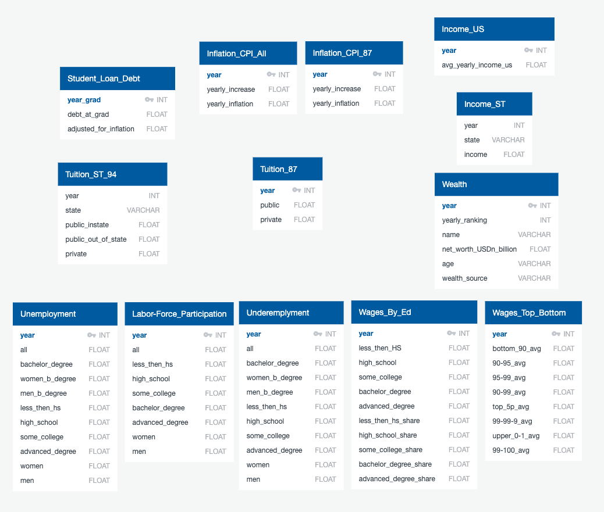
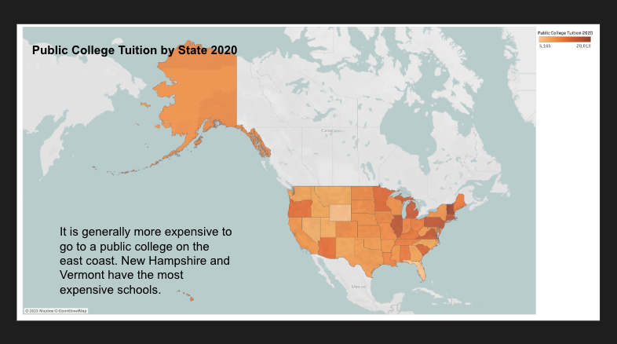
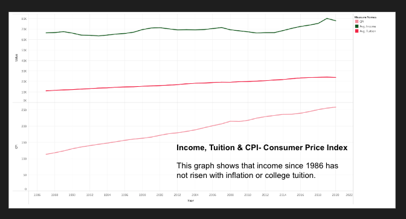

# College Tuition Analysis
## Final Group Project

## Overview
In this project we are analyzing college tuition data to investigate a possible correlation between the cost of college, inflation, income and a number of other economical factors. We seek to observe the pitch of the rise in each data set so we can come to some useful conclusions. 
 
Null Hypothesis: If income has not risen according to inflation, the cost of college should not have either and therefore the cost of college should not be related to income.
 
Alternative Hypothesis: Since college financial aid is all income based, tuition should have risen in accordance with income and therefore, they are independent of inflation.

 
### Group Members:
- Alex
- Zain
- Yawen
- Kimberly
 
## Resources
 
### Software:
- Visual Studio Code 
- Google Chrome
- pgAdmin 4
- Jupyter Notebook
- R Studio
- Tableau Desktop

 
### Languages:
- Python (libraries: pandas, numpy, os, glob, datetime, splinter, bs4, webdriver_manager.chrome, re)
- HTML
- SQL
- R
- Tableau

### Raw Data Sources
These are the links and sources to the data we started with.  
[Raw Data](data/raw_data)
- Income_US & Income_ST (csv):
    - Source [Link](https://www.census.gov/data/tables/time-series/demo/income-poverty/historical-income-households.html): United States Census Bureau
- Inflation (API Call)
    - Source [API link](https://www.minneapolisfed.org/about-us/monetary-policy/inflation-calculator/consumer-price-index-1913-): Federal reserve Bank of Minneapolis 
- Unemployment (csv) , Underemployment (csv), Wages_Top_Bottom (csv), Wages_By_Ed (csv), Labor-Force_Participation (csv)
    - Source [Link](https://www.epi.org/data/): Economic Policy Institute 
- Student_Loan_Debt (excel):
    - Source [Link](https://educationdata.org/average-student-loan-debt-by-year): Education Data Initiative
- Tuition_87  & Tuition_ST_94 (csv + excel):
    - Source [Link](https://nces.ed.gov/programs/digest/d21/tables/dt21_330.10.asp?current=yes): IES > NCES National Center for Education Statistic 
- Wealth (csv)
    - Source [Link](https://www.kaggle.com/datasets/belayethossainds/the-worlds-billionaires-dataset-19872022): The world's Billionaires Dataset 1987-2022
        

## Data Prep 
[Code](code/python)
 
### Clean Data 
This data we have cleaned and manipulated so it will work for our project.   
[Clean Data](data/clean_data)

## Data Base 
[Code](code/SQL)

## Statistical Analysis 
[Code](code/R)
 
# Results: 

## Decks
- Presentation [Google Slide Deck:](https://docs.google.com/presentation/d/1IC6qWiqES6jHyChqCqxr8XXtWpde1bSQHRc4bYMaRjk/edit?usp=sharing)
- Webpage with Tableau Story: HTML [Code](code/html/college_analysis_tableau_deck_webpage.html)
- Tableau Public [Link](https://public.tableau.com/views/CollegeTuitionEconomicAnalysis/Story?:language=en-US&:display_count=n&:origin=viz_share_link)

## Summary of Findings  

Inthis anlaysis we looked to see if there was a correlation between the rise in tuition and the rise in income and inflation. Using first t-test we looked at the correlation between tuition (public and private) vs what they should be based on inflation and saw that they were. 

Null Hypothesis: Due to the rise in inflation, and historical tuition inflation data, we would expect that tuition has followed the rise of inflation. 

Alternative Hypothesis: Since college financial aid is all income based, and income has not risen in accordance with inflation, neither should have tuition.

Based on the t-test p-values being less than 0.1, and the R^2 value of 0.98, we reject the null hypothesis and can clearly see from the graphs that tuition has not risen in accordance with inflation.

## Images 
[Image File](images)

## Final Thoughts 

During this project we learned how to successfully conceptualize and execute a project from start to finish.
- Challenges
 - Working with GitHub and figuring out the branches
 - Finding data sources that had what we needed
 - Adjusting for inflation
- Successes
 - Performed web scraping
 - Combined many excel sheets into one dataframe
 - Loaded dataframes into PgAdmin and performed  joins
 - Used joins to perform T-Test and Linear regression analysis 
 - Created different graphs and charts in Tableau that showed us an overall big picture 

-----------------------------------------

### Project Proposal: 

We have a four people group. The project that we have decided on is to look at the possible correlation between the cost of college, inflation, and income. We will also look at cost of living in different areas as well as look at different economic classes and see if their rise in income and cost of living matches the others.
 
Our null hypothesis is that since income has not risen according to inflation, the cost of college should not have either, the cost of college should not be related to income.
 
Our alternative hypothesis is that since college financial aid is all income based it should have risen in accordance with income and therefore, they are independent of inflation.
 
We will also look at the different tiers of universities/colleges and salaries guaranteed after graduation and how that relates to income and inflation. 

#### Graphs to create:
Look at different geographies and then compare the data of cost of living and salaries when compared to schools in that area
Map looking at cost of living when compared to income level (wealth) and cost of college across US
Looking at income vs. wealth and how that compares to the rise. 

Additionally we will talk about the unemployment rate and how that factors in and that the data is not reliable.
